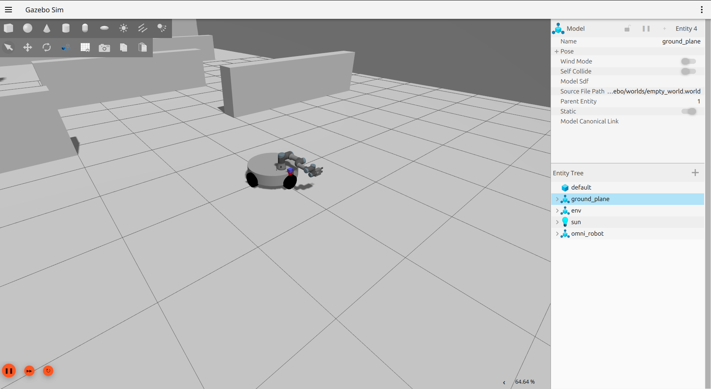
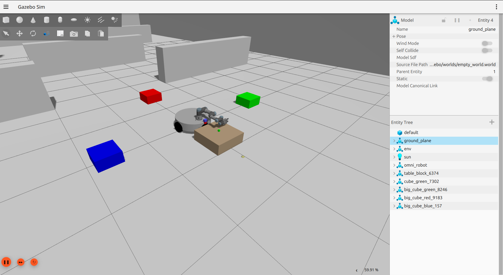

# Omni-Robot System with Pick-and-Place Task

A complete ROS2-based autonomous robotic system featuring an omni-directional mobile base equipped with a UR3 collaborative arm. The system is designed to autonomously pick small colored cubes and place them next to matching-colored larger cubes.


## Project Overview

This workspace contains a fully integrated robotic manipulation system with:
- **Hardware**: Omni-directional mobile base (omni wheels) + UR3 robotic arm
- **Simulation**: Gazebo Sim with physics-based object interaction
- **Perception**: OpenCV-based color detection and vision processing
- **Planning**: MoveIt2 for arm inverse kinematics and motion planning
- **Control**: ROS2 control framework for base and arm actuation
- **Task**: Autonomous color-matching pick-and-place workflow

## System Architecture

```
Physical/Simulation Layer
├── omni_gazebo
│   └── Gazebo environment, robot spawning, physics simulation
│
Hardware Interface Layer
├── omni_control
│   └── Motor controllers, joint commands, actuator drivers
│
Robot Description Layer
├── omni_robot_description
├── omni_description
│   └── URDF/Xacro models, kinematics, RViz visualization
│
Planning & Navigation Layer
├── omni_moveit2
│   └── Arm inverse kinematics, motion planning, collision checking
└── omni_navigation (Under Development)
    └── SLAM, path planning, navigation stack
│
Task Execution Layer
└── pick_and_place
    ├── Cube spawning & detection
    ├── Arm grasping & manipulation
    ├── Base navigation & positioning
    └── Color matching workflow
```

## Package Descriptions

### omni_robot_description
Defines the robot's structure (shape, size, joints). Contains the 3D model files and tells ROS what the robot looks like.

### omni_description
Shows the robot on the screen in RViz (visualization tool). Displays the robot's current position and arm configuration.

### omni_control
Controls the robot's motors and actuators. Handles commands like "move forward" and "rotate arm" and sends them to the motors.

### omni_gazebo
Creates the virtual environment where the robot operates. Runs the physics simulation, spawns cubes, and simulates camera/sensors.

### omni_moveit2
Plans how the arm should move. Calculates arm positions, checks for collisions, and generates safe motion paths.

### omni_navigation !!! (Under Development)
Will handle robot navigation (mapping, path planning). Not yet completed—reserved for future features.

### pick_and_place
The main task program. Detects colored cubes, picks them up, and places them next to matching colors.

**Workflow**:
1. Spawn test objects (1 small cube, 3 large cubes)
2. Detect small cube color via camera
3. Pick small cube using arm
4. Rotate base to scan large cubes
5. Match colors and locate target
6. Navigate base to target position
7. Place small cube beside matching large cube

```bash
# Create workspace directory
mkdir -p ~/ros2_ws/src
cd ~/ros2_ws/src

# Clone this repository (replace with your repo URL)
git clone <repository-url> .
```


### 2. Install ROS2 Jazzy

```bash
# Follow official ROS2 installation guide
# https://docs.ros.org/en/jazzy/Installation.html

# Ubuntu installation (example):
sudo apt update
sudo apt install software-properties-common
sudo add-apt-repository universe
sudo apt update && sudo apt import-archive-keyring https://repo.ros2.org/ros.key -o /usr/share/keyrings/ros-archive-keyring.gpg
echo "deb [arch=$(dpkg --print-architecture) signed-by=/usr/share/keyrings/ros-archive-keyring.gpg] http://packages.ros.org/ros2/ubuntu $(. /etc/os-release && echo $UBUNTU_CODENAME) main" | sudo tee /etc/apt/sources.list.d/ros2.list > /dev/null
sudo apt update
sudo apt install ros-jazzy-desktop
```

### 3. Install Workspace Dependencies

```bash
cd ~/ros2_ws

# Install ROS dependencies
rosdep install --from-paths src --ignore-src -r -y

# Install Python dependencies
pip install opencv-python opencv-contrib-python numpy
```

### 4. Build the Workspace

```bash
cd ~/ros2_ws

# Build all packages
colcon build
```

### 5. Source the Workspace

```bash
# Add to your .bashrc for persistence
echo "source ~/ros2_ws/install/setup.bash" >> ~/.bashrc
source ~/ros2_ws/install/setup.bash
```

## Quick Start

### Launch the Gazebo Simulation + Robot System

**Terminal 1: Start Gazebo with robot**
```bash
ros2 launch omni_gazebo omni_gazebo.launch.py
```



This will:
- Start Gazebo with physics simulation
- Spawn the omni-robot (base + UR3 arm)
- Load controllers for base and arm
- Initialize sensor bridges (camera, odometry)


### Run the Pick-and-Place Task

**Terminal 3: Execute color-match workflow**
```bash
ros2 launch pick_and_place color_match.launch.py
```
This will:
1. Spawn 1 small cube (random color) and 3 large cubes (random colors each)
2. Detect the small cube color
3. Pick the small cube
4. Scan the large cubes by rotating the base
5. Match colors and locate target
6. Navigate to the target position
7. Place the small cube



## Parameter Customization

### Launch Arguments

```bash
# Control timing between node startup
ros2 launch pick_and_place color_match.launch.py wait_sec:=4.0

# Adjust rotation speed
ros2 launch pick_and_place color_match.launch.py angular_speed:=0.25

# Tune navigation heading control
ros2 launch pick_and_place color_match.launch.py nav_heading_kp:=1.5

# Combine multiple arguments
ros2 launch pick_and_place color_match.launch.py \
  wait_sec:=4.0 \
  angular_speed:=0.28 \
  nav_heading_kp:=1.5 \
  nav_lin_tolerance:=0.10
```

## Troubleshooting

### Gazebo Won't Start
- Check GPU drivers: `glxinfo | grep OpenGL`
- Try running with headless rendering: `export IGN_HEADLESS_RENDERING=1`
- Verify Gazebo is installed: `which gz`

### Nodes Crash After Startup
- Check logs: `ros2 launch pick_and_place color_match.launch.py 2>&1 | grep -i error`
- Verify all dependencies installed: `rosdep check --all --from-paths src`
- Ensure workspace is properly sourced: `echo $COLCON_PREFIX_PATH`

### Robot Doesn't Move
- Check if controllers are loaded: `ros2 control list_controllers`
- Verify /cmd_vel is being published: `ros2 topic echo /cmd_vel`
- Check odometry: `ros2 topic echo /odom`

### Color Detection Fails
- Verify camera is publishing: `ros2 topic echo /camera/image_raw --once`
- Adjust HSV color ranges in node code if lighting different
- Ensure cubes are within camera field of view

### Task Doesn't Complete
- Increase `wait_sec` parameter for longer startup delays
- Check node logs for timeouts: `ros2 node list` then `ros2 node info /node_name`
- Verify message topics are being published: `ros2 topic list`

## ROS2 Topics Reference

### Critical State Topics (latched, TRANSIENT_LOCAL)
- `/color_match/small_cube_color` (String) - Detected small cube color
- `/color_match/picked_cube_color` (String) - Color after grasping
- `/color_match/start_scan` (Bool) - Trigger for base scanning
- `/color_match/target_big_cube` (String) - Matched target location

### Sensor Topics
- `/camera/image_raw` (Image) - RGB camera feed
- `/odom` (Odometry) - Base odometry (position, heading)
- `/imu` (Imu) - Inertial measurement unit

### Control Topics
- `/cmd_vel` (Twist) - Base velocity commands
- `/arm/trajectory_controller/follow_joint_trajectory` (action) - Arm trajectory control


**Last Updated**: March 2026  
**ROS2 Version**: Jazzy  
**Python Version**: 3.12+
